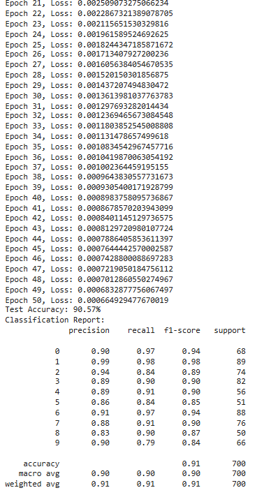
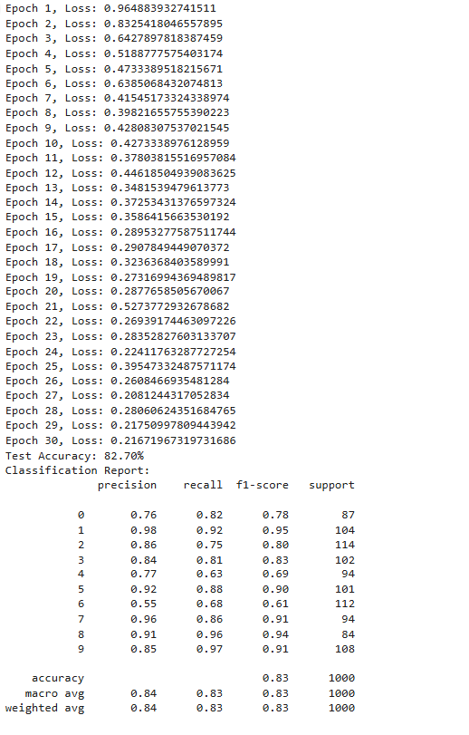

# Neural Network from Scratch 

Frameworks like TensorFlow and PyTorch abstract away many of the complexities of building machine learning models, making them highly efficient for practical use. However, this abstraction can sometimes prevent practitioners from fully understanding the underlying principles. To bridge gaps in my own learning, such as Xavier's initialization and backpropagation, I decided to build a deep neural network from scratch as a personal project. My goal was to gain a deeper, hands-on understanding of how these models work at a fundamental level. I created a flexible architecture where users could add as many layers as needed, using only the most basic libraries such as Pandas and NumPy. The model was trained and tested on the MNIST Digit Classification and Fashion Classification datasets, providing a rough estimate of its performance. While the project was primarily for learning, the results were encouraging, demonstrating that even a simple, scratch-built model could achieve solid performance.
 

## Results

The model achieved an accuracy of 90.57% on the MNIST Digit Classification dataset and 82.70% on the MNIST Fashion Classification dataset.

<<<<<<< HEAD
### MNIST Digit Classification :

### MNIST Fashion Classification :

=======
MNIST Digit Classification :

MNIST Fashion Classification :

>>>>>>> 532d7d1 (Update README.md)
